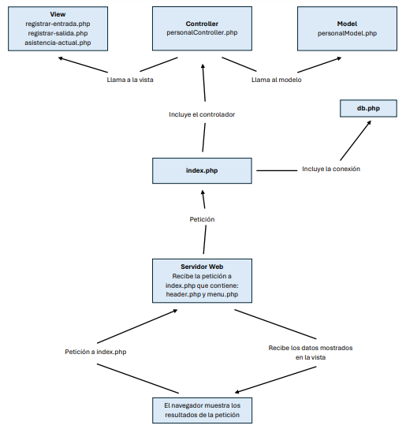
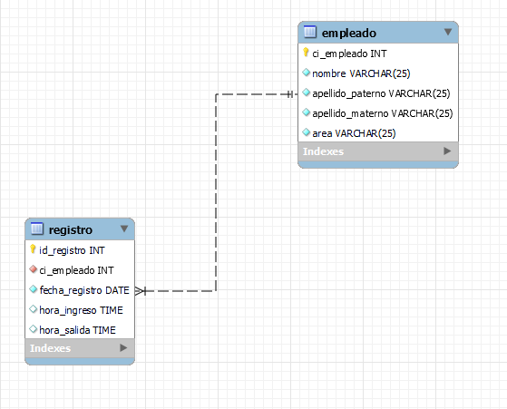
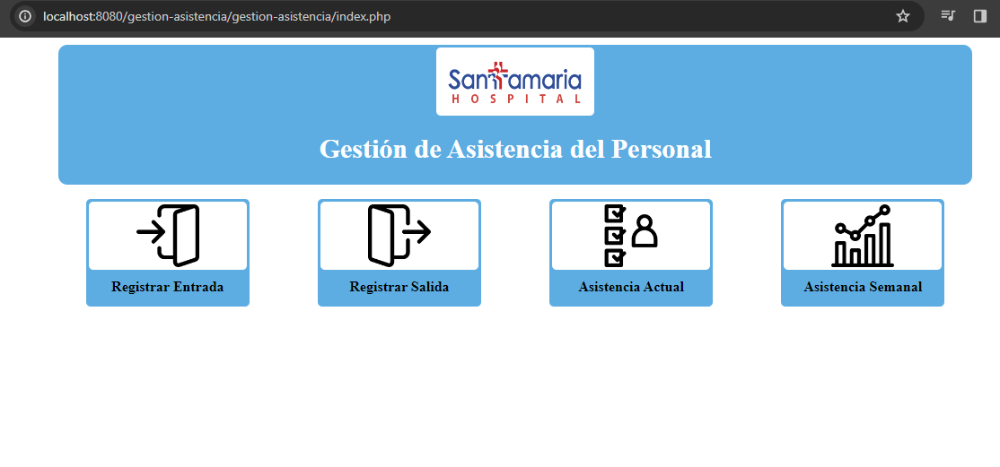
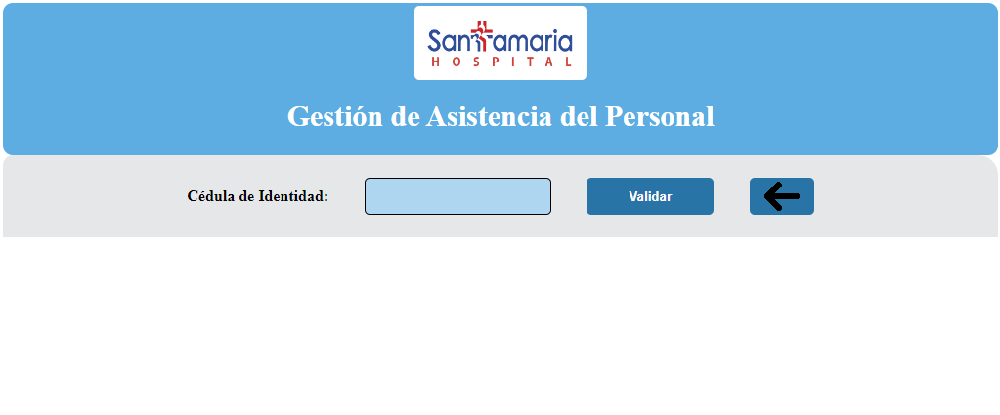
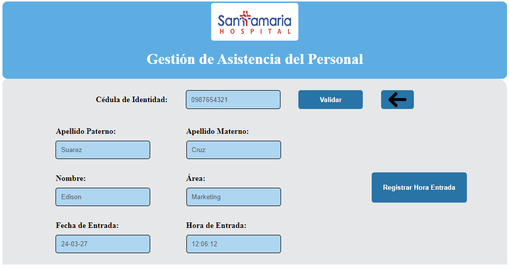
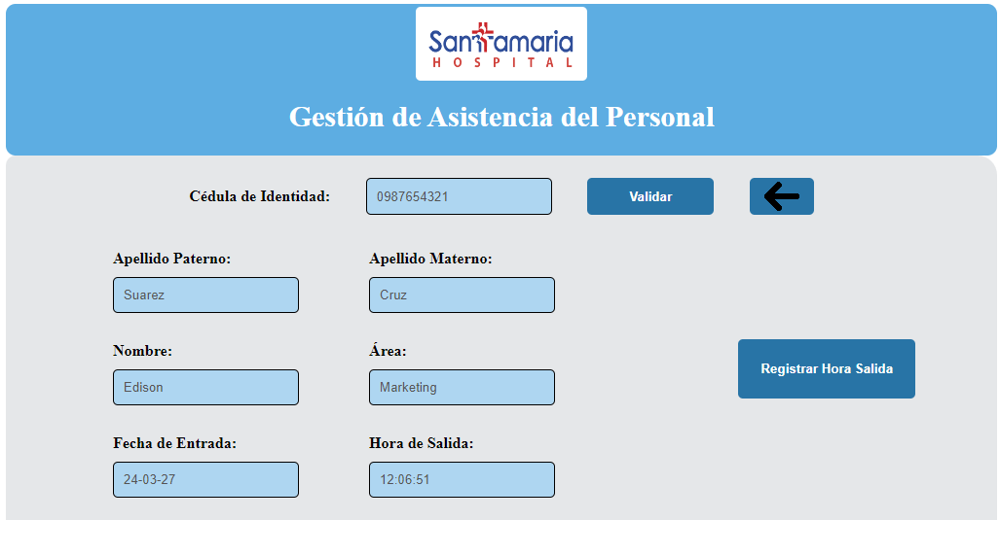
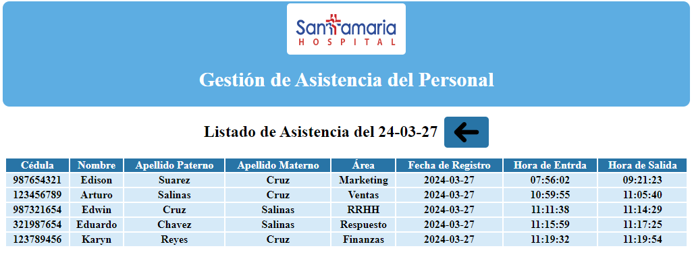

# Resultado

## Arquitectura MVC
> La arquitectura que se utilizó para la organizacion y desarrollo de la aplicacin web fue el **Modelo-Vista-Controlador**.

## Diagrama Entidad Relación
> Para el tratamiento de los datos en la DataBase se creo dos tablas **empleado** y **registro**.

## Aplicación Web
> **Página de inicio (*index.php*)**: Muestra un menú compuesto por cuatro opciones para navegar en el sistema.

> **Sección Buscar por Cédula (*registrar_entrada.php y registrar_salida*)**: Dicha sección es para buscar en la db si pertenece a la empresa. (Tomando como restrinción que no todos los usuarios pueden registrar su hora de entrada y salida si no pertenece a la empresa).

> **Página Registrar Entrada (*registrar_entrada.php*)**: Después de la validación de la cédula, muestra los datos obtenidos de la db, adicionalmente la fecha y hora actual para luego guardar dichos datos en la db.

> **Página Registrar Salida (*registrar_salida.php*)**: Después de la validación de la cédula, muestra los datos obtenidos de la db, adicionalmente la fecha y hora actual para luego guardar dichos datos en la db.

> **Página Listado de Asistencia (*listado_asistencia.php*)**: Se muestra todos los registro de asistencia para el día actual.

